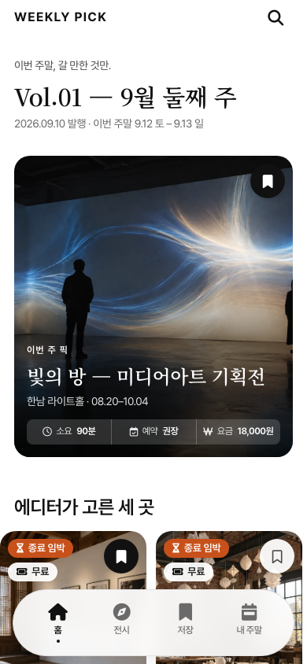
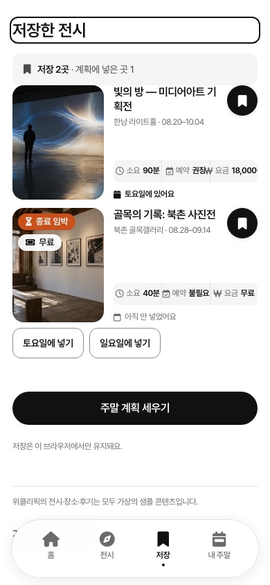
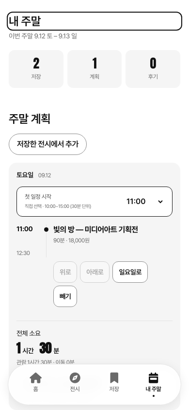
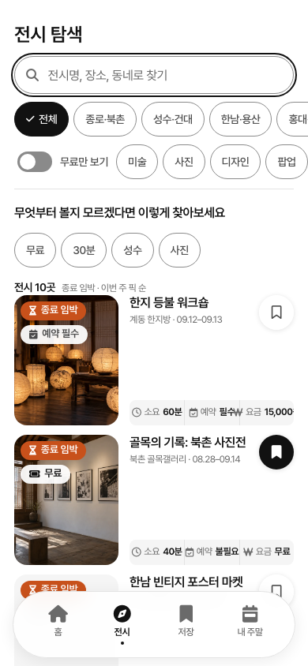

# 위클리픽 · WEEKLY PICK

**전시를 발견하고, 저장하고, 이번 주말 일정으로 이어가는 모바일 웹 포트폴리오.**

서울 전시·팝업을 매거진처럼 둘러보는 경험에 주말 계획과 방문 후기를 연결했습니다. 디자인 토큰부터 화면 구현, 이메일 로그인과 계정별 동기화, 브라우저 회귀 검사까지 포함합니다.

[라이브 데모](https://weekly-pick.vercel.app) · [구현 PR](https://github.com/jaejinu/weekly-pick/pulls?q=is%3Apr+is%3Amerged) · [자동 검증](https://github.com/jaejinu/weekly-pick/actions/workflows/test.yml)

| 발견 | 저장 | 주말 계획 |
|:---:|:---:|:---:|
|  |  |  |

> 가상의 전시·기사·샘플 후기와 AI 생성 이미지를 사용하는 데모입니다. 실제 행사 일정이나 예매 서비스가 아닙니다. 화면은 비로그인 데모 상태입니다.

## 체험 순서

1. **둘러보기**에서 지역·요금·태그로 전시를 찾고 저장합니다.
2. **저장**에서 토요일 또는 일요일에 전시를 배정합니다.
3. **내 주말**에서 순서와 시작 시각을 바꾸고 관람·이동·종료 예상 시각을 확인합니다.
4. 내 주말 하단의 **데모 날짜 설정**을 바꿔 방문 기록과 후기 작성·수정·삭제·되돌리기를 체험합니다.
5. 이메일 링크로 로그인하면 계정에 기록을 저장합니다. 기존 브라우저 기록은 가져오기를 확인한 경우에만 합칩니다. 저장·계획·후기에서 로그인으로 이동했다면 인증 후 원래 화면으로 돌아갑니다. 작업은 자동 실행하지 않으며, 이미 가져온 기록은 반복 안내하지 않습니다.

비로그인 상태에서도 기본 흐름을 체험할 수 있습니다. 로그인 메일은 요청한 브라우저에서 열어 주세요. 로그인 상태의 후기는 공개 피드에 표시됩니다.

## UX에서 해결한 문제

| 문제 | 구현한 동작 |
|---|---|
| 저장한 전시를 실제 일정으로 연결하기 어려움 | 요일 배정, 순서 변경, 시작 시각 선택과 관람·이동 합계. 4시간 초과 안내 |
| 후기 작성 중 화면을 이동하면 입력 유실 | 같은 탭의 초안 복원, 실제 변경이 있을 때만 이탈 확인, 삭제 되돌리기 |
| 한글 검색과 재렌더링 중 입력·포커스 끊김 | IME 조합 중 입력 노드 유지, 필터·정렬·일정 조작 후 포커스 유지 |
| 로그인 전 기록과 계정 기록이 섞일 가능성 | 명시적 가져오기, 계정별 미저장 변경·초안 분리, 로그아웃 시 게스트 기록 복원 |
| 여러 기기의 저장이 서로 덮어쓸 가능성 | 리비전 기반 충돌 감지와 다시 불러오기 안내 |
| 키보드로 화면 이동 후 현재 위치를 파악하기 어려움 | 목적 화면 제목으로 포커스 이동, 화면별 브라우저 제목, 검색창 포커스 표시 |

이 표는 구현과 회귀 검사 결과입니다. 사용자 관찰을 통한 사용성 개선 수치나 실제 iPhone 검증 결과를 의미하지 않습니다.

## 개선 사례: 화면 이동 후 현재 위치 알기

하단의 **저장** 링크를 키보드로 실행하면 화면은 바뀌지만 포커스가 새 콘텐츠로 이어지지 않았습니다. 이를 브라우저 회귀 검사에서 재현한 뒤, 앱 내 화면 이동 시 목적 화면의 대표 제목으로 포커스를 옮기도록 수정했습니다. 기존 스크롤 복원은 유지하고, 검색 바로가기는 검색창을 우선합니다. 같은 화면에서 필터나 일정 순서를 바꾸는 경우에는 조작한 버튼의 포커스를 유지합니다.

후기 피드·동네별 보기·지난 호에는 보조기술용 대표 제목을 추가했고, 브라우저 탭 제목도 현재 화면에 맞춰 갱신합니다. 검색창은 입력 중 포커스 테두리를 표시합니다.



검증 근거는 `tests/browser-accessibility.cjs`와 Chromium·WebKit 회귀 검사입니다. 실제 VoiceOver 낭독 검증은 미완료이며, [접근성 점검 기록](docs/accessibility-review.md)에 확인 범위와 제한을 구분했습니다. [사용자 테스트 과제·기록 양식](docs/usability-test.md)은 준비했으며 아직 참여자 관찰 결과는 없습니다.

## 구조와 기술 선택

HTML, CSS, Vanilla JavaScript로 정적 화면을 구성하고 Supabase를 인증·데이터 저장에 사용합니다. UI 실행에는 빌드가 필요 없으며 Supabase SDK 번들은 저장소에 포함합니다. SDK 변경 시에만 `npm run build:auth`로 다시 생성합니다.

| 영역 | 파일과 책임 |
|---|---|
| 디자인 시스템 | `css/tokens.css` → 공통 색상·타이포·간격, `components.css` → 공용 UI, `app.css` → 화면 배치 |
| 화면 | `js/app.js` → 해시 라우팅·이벤트, `js/components.js` → 공용 렌더링 |
| 상태 | `js/state.js` → 계획·방문·후기·마이그레이션, `js/drafts.js` → 같은 탭의 입력 복원 |
| 계정 | `js/account.js`, `account-data.js`, `account-ui.js` → 인증·동기화·계정 화면 |
| 데이터베이스 | `supabase/migrations/` → 계정별 RLS, 후기 소유권 검사와 저장 RPC |
| 메일 | Supabase Auth + Resend SMTP, 한국어 템플릿은 `supabase/templates/` |
| 배포·검증 | Vercel, GitHub Actions, Node test runner, PGlite, Playwright |

계정의 저장 목록·계획은 비공개이고 후기는 공개입니다. 공개 후기 RPC는 내부 계정 ID를 반환하지 않습니다. 로그인에는 개인정보 안내·동의와 Turnstile 검증을 적용하며, 내 계정에서 본인 계정·연결 기록을 삭제할 수 있습니다. 서버의 RLS와 RPC가 접근·작성자 권한을 검사합니다. 브라우저 설정에는 공개용 publishable 키만 사용하며, SMTP 비밀 키나 Supabase secret/service-role 키는 클라이언트에 넣지 않습니다.

## 로컬 실행

```bash
git clone https://github.com/jaejinu/weekly-pick.git
cd weekly-pick
```

독립적인 비로그인 데모로 실행하려면 `js/config.js`의 내용을 다음과 같이 바꿉니다. 저장소의 기본 설정은 라이브 데모의 공개 Supabase 프로젝트를 가리킵니다.

```js
window.WEEKLY_PICK_CONFIG = Object.freeze({});
```

```bash
python3 -m http.server 8777
# http://localhost:8777
```

Docker를 사용한다면 `docker compose up -d --build` 후 `http://localhost:8080`에서 확인할 수 있습니다.

독립된 로그인 환경은 본인의 Supabase 프로젝트에 `supabase/migrations/`의 SQL을 적용한 뒤, `js/config.js`에 `supabaseUrl`, `supabasePublishableKey`를 설정합니다. 마이그레이션은 파일명 순으로 적용합니다. 기존 배포를 갱신할 때는 `002` 적용 → 새 앱 배포 → `003` 적용 순서를 사용합니다. Supabase Auth의 Site URL·허용 Redirect URL을 본인 앱 주소로 지정하고 이메일 발송 설정과 `supabase/templates/`를 적용합니다. Cloudflare Turnstile 위젯에 본인 앱 호스트를 등록하고 공개 사이트 키를 `turnstileSiteKey`에, 비밀 키를 Supabase Auth의 Attack Protection에 설정합니다. 위젯이 없는 기존 앱을 먼저 교체한 뒤 서버 CAPTCHA를 활성화합니다. 비밀 키는 서버 서비스 설정에서만 관리합니다.

## 검증

Node.js 22 기준:

```bash
npm ci
npx playwright install chromium webkit
npm test
npm run test:browser
npm run test:webkit
npm run test:account
BROWSER=webkit npm run test:account
```

- 상태·초안·계정·PostgreSQL 정책 테스트. 공개 조회의 계정 ID 차단, 본인 탈퇴·다른 계정 보존·삭제 후 재저장 차단을 포함합니다.
- Chromium·WebKit에서 주요 10개 경로를 360·390·430px로 검사하고 계획·후기·키보드·빈 상태 흐름을 검증합니다.
- 계정 브라우저 검사는 같은 브라우저의 새 탭 로그인 복귀·자동 쓰기 방지·가져오기 안내 중복 방지도 포함합니다. 실제 Supabase SDK와 모의 HTTP 응답을 사용합니다. 실제 메일 발송 검사를 대신하지 않습니다. CAPTCHA 토큰 만료·동의, 탈퇴 확인·실패·재시도와 로컬 기록 정리를 모의 환경에서 검사합니다. 실사용자 계정을 자동 검사에서 삭제하지 않습니다.
- PR과 `main` 푸시 시 GitHub Actions에서 실행합니다. 독립 테스트 브라우저를 사용하며 화면 캡처는 Actions에 7일간 보관합니다.

실제 계정 저장·복원은 별도로 확인했고, 커스텀 발신 메일 수신과 로그인은 사용자 확인을 받았습니다. 실제 iPhone Safari·스크린리더·사용자 관찰 검증은 남아 있습니다.

## 디자인·개발 기록

- [V1 디자인 규정](weeklypick/weeklypick-design-rull.md): 토큰·타이포·컴포넌트 기준
- [V1 화면 명세](weeklypick/weeklypick-project.md): 초기 화면·샘플 데이터 설계
- [V2 범위](v2/02-v2-scope.md) · [V2 구현과 검증 기록](v2/04-implementation.md)
- [이미지 생성 프롬프트](weeklypick/weeklypick-image-prompts.md) · [이미지 사양](assets/images/README.md)

V1 문서는 당시의 설계 기록입니다. 현재 로그인·동기화와 후속 UX 개선은 코드와 병합 PR을 기준으로 확인할 수 있습니다. 과거 커밋에는 개발 과정의 문서도 남아 있습니다.

## 범위

전시 데이터 연동, 실시간 길찾기, 예약·결제는 포함하지 않습니다. 이동 시간은 권역별 데모 예상값이며 날짜는 시나리오 재현용 프리셋입니다. 이미지 10장은 생성형 AI로 제작한 샘플 비주얼입니다. 외부 라이브러리의 고지는 [THIRD-PARTY-NOTICES](js/vendor/THIRD-PARTY-NOTICES.txt)에서 확인할 수 있습니다.
